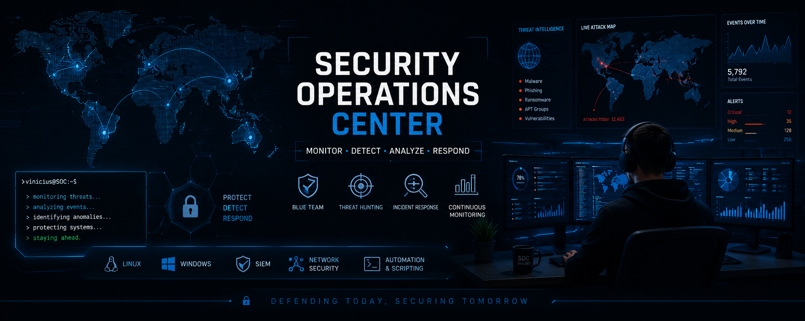

# 👋 Olá, eu sou Vinicius Augusto

🔐 SOC Analyst | Blue Team | Cybersecurity | SIEM

Atualmente atuando como Aprendiz de SOC na Global HITSS Brasil, desenvolvendo conhecimentos práticos em monitoramento de eventos, análise de ameaças, investigação de incidentes e segurança defensiva.

Tenho foco em Blue Team, infraestrutura segura, análise de vulnerabilidades e laboratórios práticos voltados para Cybersecurity.

---

# 🚀 Sobre mim

Sou estudante da área de Cybersecurity com foco em:

- SOC Operations
- Blue Team
- Linux
- Redes
- SIEM
- Hardening
- Python para automação
- Análise de Logs
- Segurança Ofensiva e Defensiva

Tenho interesse em ambientes defensivos, monitoramento de ameaças, análise de incidentes e infraestrutura segura.

---

# ⚙️ Tecnologias e áreas de atuação

---

# 🛠️ Ferramentas e Tecnologias

## Cybersecurity

- Wireshark
- Nmap
- OpenVAS
- Metasploit Framework
- Hydra
- WPScan
- MITRE ATT&CK
- OWASP Top 10
- Hardening
- Vulnerability Assessment

## Redes e Infraestrutura

- Cisco Packet Tracer
- GNS3
- Switching
- Routing
- DNS
- DHCP
- FTP
- HTTP

## Desenvolvimento e Automação

- Python
- Git
- GitHub
- Linux Shell

---

# 📂 Projetos em Destaque

## 🛡️ Cisco SSH Brute Force Threat Simulation
Simulação prática de ameaça interna em ambiente Cisco IOS utilizando SSH Brute Force, MITRE ATT&CK e Cyber Kill Chain.

---

## 💀 Metasploitable VSFTPD Exploit Lab
Exploração prática da vulnerabilidade VSFTPD 2.3.4 Backdoor em ambiente controlado.

---

## 📊 OpenVAS Vulnerability Assessment
Análise de vulnerabilidades utilizando OpenVAS em laboratório prático.

---

## 🌐 Packet Tracer Network Lab
Laboratório de infraestrutura de redes com DHCP, DNS, HTTP e FTP.

---

## 🛡️ MAC Flooding Detection and Mitigation
Laboratório demonstrando ataques MAC Flooding e técnicas de mitigação com Port Security.

---

## 🌍 WordPress Enumeration and Exploitation Lab
Reconhecimento, enumeração e exploração controlada em ambiente WordPress vulnerável.

---

# 📚 Atualmente estudando

- ISO 27001
- SOC Operations
- Segurança Defensiva
- Blue Team
- Python para Cybersecurity
- Redes de Computadores
- Monitoramento e análise de eventos

---

# 🎯 Objetivo Profissional

Desenvolver carreira na área de Cybersecurity com foco em SOC, Blue Team e Segurança Defensiva, buscando evolução contínua através de laboratórios, projetos práticos e estudos constantes.

---

# 📫 Contato

- LinkedIn:
https://www.linkedin.com/in/vinicius-augusto-bibiano/

- GitHub:
https://github.com/BibianoVinicius

---

⭐ Sempre em evolução na área de Segurança da Informação.
